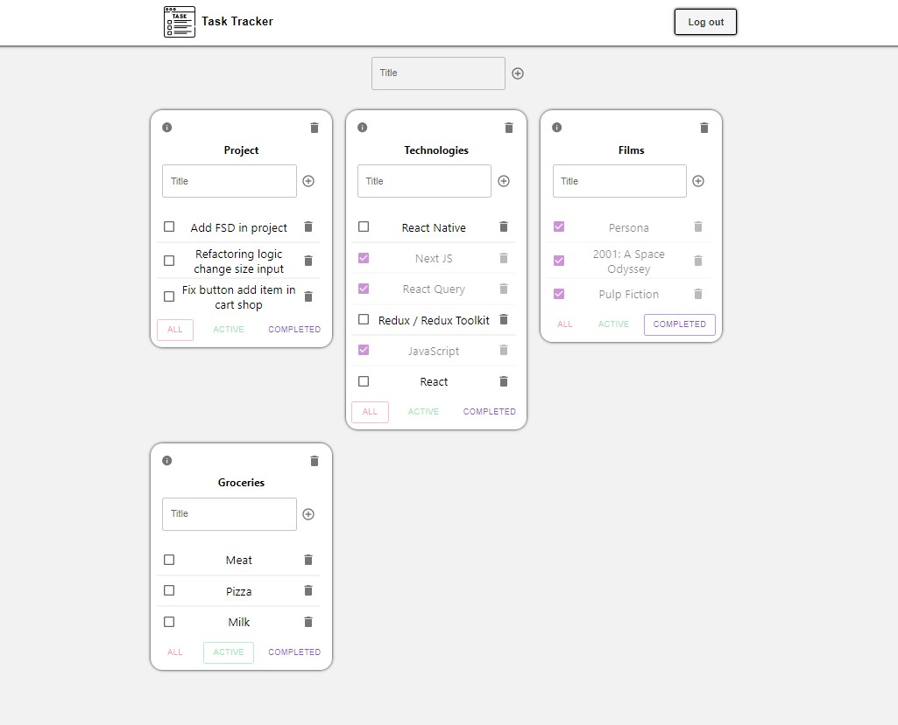
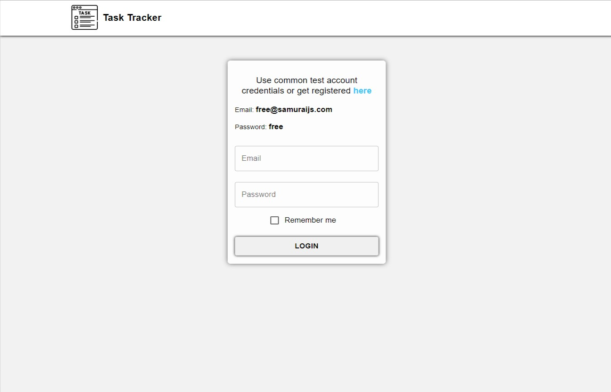
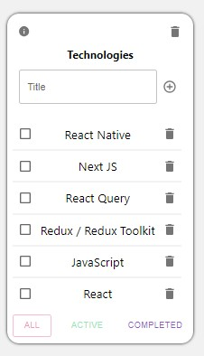
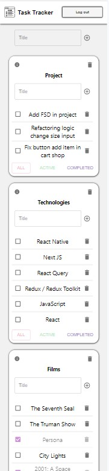

# Task Tracker

### Website [Task Tracker](https://talerqa.github.io/tasktracker/)

A list of things you need to do or want to do. When a task is completed, it is usually crossed off the list

### Technologies:

- React
- TypeScript
- Redux Toolkit
- React-Redux
- React-Router-Dom
- Axios
- Formik
- SASS
- MUI

<h2 align='center'>Main Page</h2>

  

<h2 align='center'>Auth Page</h2>

  

<h2 align='center'>Task tracker</h2>

  

<h2 align='center'>Mobile design</h2>

  

